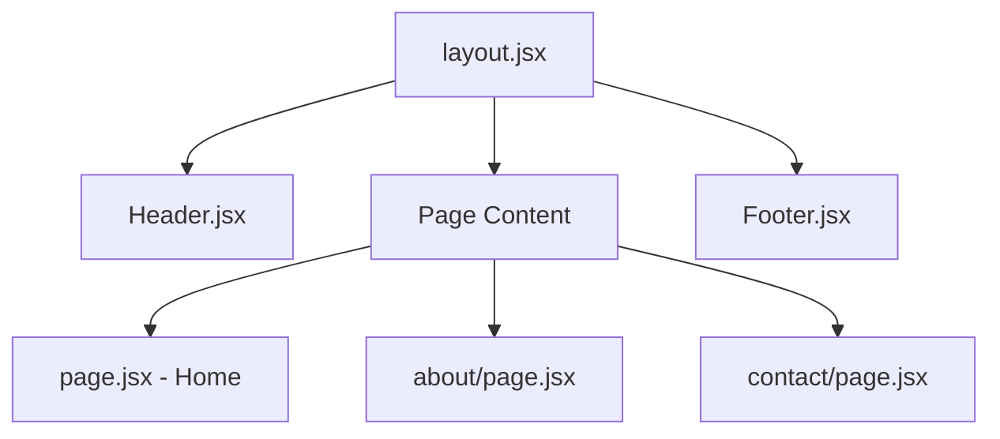

# Architecture Overview

This document provides an overview of the Interior Designer Portfolio project architecture.

## Technology Stack

| Layer | Technology | Version |
|-------|------------|---------|
| Framework | Next.js | 16.1.1 |
| Language | JavaScript (JSX) | ES6+ |
| Styling | TailwindCSS | v4 |
| Build Tool | Turbopack | Built-in |
| Package Manager | npm | Latest |

## Project Structure

```
interior-designer-portfolio/
├── docs/                    # Project documentation
│   ├── ARCHITECTURE.md      # This file
│   ├── IMPLEMENTATION.md    # Implementation details
│   └── SESSION_NOTES.md     # Development session notes
├── public/                  # Static assets
├── src/
│   ├── app/                 # Next.js App Router pages
│   │   ├── layout.jsx       # Root layout with Header/Footer
│   │   ├── page.jsx         # Home page
│   │   ├── globals.css      # Global styles & CSS variables
│   │   ├── about/
│   │   │   └── page.jsx     # About page
│   │   └── contact/
│   │       └── page.jsx     # Contact page
│   └── components/          # Reusable components
│       ├── Header.jsx       # Navigation header
│       └── Footer.jsx       # Site footer
├── CHANGELOG.md             # Commit history documentation
├── package.json             # Dependencies & scripts
└── README.md                # Project readme
```

## Component Architecture



## Data Flow

This is a **static portfolio site** with no backend requirements. All content is currently hardcoded in the components. Future enhancements could include:

- CMS integration (Contentful, Sanity, or Strapi)
- Contact form backend (API routes or external service)
- Portfolio gallery with dynamic data

## Styling Approach

- **CSS Variables**: Defined in `globals.css` for consistent theming
- **TailwindCSS v4**: Utility-first CSS framework
- **Responsive Design**: Mobile-first approach with breakpoints
- **Dark Theme**: Elegant dark color palette with gold accents

## Key Design Decisions

1. **Next.js App Router**: Modern routing with React Server Components support
2. **JSX over TSX**: Simplified development without TypeScript overhead
3. **Component-based**: Reusable Header/Footer across all pages
4. **CSS Variables**: Easy theming and consistent colors
